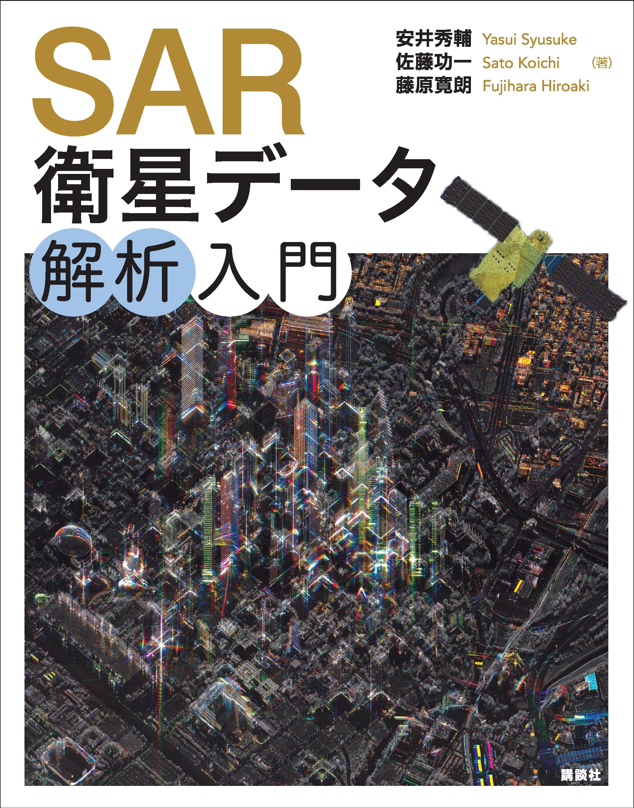

# 📕 書籍 *SAR衛星データ解析入門* の Githubレポジトリ

[日本語](https://github.com/syu-tan/sar-python-book/blob/main/README.md) | [English](doc/READM_en.md)

書籍「*SAR衛星データ解析入門*」の Python実装コードを管理する公式レポジトリです。本コードは、[ライセンス](./LICENSE)に従えば、無料で商用利用できます。

# 🚀 書籍の紹介

- 書籍は[講談社サイエンティフィク]()さんから頒布しております。
- 著者による書籍自体の紹介記事は[こちら]()です。

# 🔍 関連記事
書籍の公開記念記事の一覧です。

# 💻 コードと章の対応

| 章                        | 節                      | 内容                           | ノートブックファイル                                                                                                                                                                                                                                                                                                                                                                                                                                                                                                                                                                                            |
| ------------------------- | ----------------------- | ------------------------------ | --------------------------------------------------------------------------------------------------------------------------------------------------------------------------------------------------------------------------------------------------------------------------------------------------------------------------------------------------------------------------------------------------------------------------------------------------------------------------------------------------------------------------------------------------------------------------------------------------------------- |
| 第1章 SARの基礎と観測原理 |                         |                                |                                                                                                                                                                                                                                                                                                                                                                                                                                                                                                                                                                                                                 |
|                           | 合成開口                | 合成開口の基本                 | <ul><li> [1\_1\_3\_impulse\_response.ipynb](./src/1_1_3_impulse_response.ipynb)</li> <li>[1\_1\_6\_migration.ipynb](./src/1_1_6_migration.ipynb)</li> <li>[1\_1\_7\_999\_synthetic\_aperture.ipynb](./src/1_1_7_999_synthetic_aperture.ipynb)</li> <li>[1\_1\_7\_focus.ipynb](./src/1_1_7_focus.ipynb)</li></ul>                                                                                                                                                                                                                                                                                       |    | 強度画像 | マルチルッキングなど | <ul><li>[1\_3\_3\_multilooking.ipynb](./src/1_3_3_multilooking.ipynb)</li></ul> |
|                           | レーダー特有の現象      | アンビギュイティ、RFI など     | <ul><li>[1\_3\_7\_ambiguity\_azimuth.ipynb](./src/1_3_7_ambiguity_azimuth.ipynb)</li> <li>[1\_3\_7\_ambiguity\_range.ipynb](./src/1_3_7_ambiguity_range.ipynb)</li> <li>[1\_3\_9\_radio\_frequency\_interference.ipynb](./src/1_3_9_radio_frequency_interference.ipynb)</li></ul>                                                                                                                                                                                                                                                                                                                         |
|                           | SARの性能               | 偏波・ビーム・軌道             | <ul><li>[1\_3\_1\_polarimetry.ipynb](./src/1_3_1_polarimetry.ipynb)</li> <li>[1\_3\_2\_antena\_pattarn.ipynb](./src/1_3_2_antena_pattarn.ipynb)</li> <li>[1\_3\_2\_beam.ipynb](./src/1_3_2_beam.ipynb)</li> <li>[1\_3\_2\_orbit.ipynb](./src/1_3_2_orbit.ipynb)</li></ul>                                                                                                                                                                                                                                                                                                                              |
|                           | 干渉SAR                 | 干渉処理全般                   | <ul><li>[1\_5\_1-2-3-5-6-7\_insar.ipynb](./src/1_5_1-2-3-5-6-7_insar.ipynb)</li> <li>[1\_5\_3\_coregistolation.ipynb](./src/1_5_3_coregistolation.ipynb)</li> <li>[1\_5\_4\_wrap\_phase.ipynb](./src/1_5_4_wrap_phase.ipynb)</li> <li>[1\_5\_6\_insar\_2pass.ipynb](./src/1_5_6_insar_2pass.ipynb)</li> <li>[1\_5\_6\_insar\_3pass.ipynb](./src/1_5_6_insar_3pass.ipynb)</li> <li>[1\_5\_9\_baseline.ipynb](./src/1_5_9_baseline.ipynb)</li> <li>[1\_5\_999\_insar\_topo.ipynb](./src/1_5_999_insar_topo.ipynb)</li></ul>                                                                     |
|                           | 合成開口の応用          | 高度なSAR処理                  | <ul><li>[1\_6\_1\_chirp\_scaling.ipynb](./src/1_6_1_chirp_scaling.ipynb)</li> <li>[1\_6\_1\_stolt\_interpolation.ipynb](./src/1_6_1_stolt_interpolation.ipynb)</li> <li>[1\_6\_2\_speckle\_noise.ipynb](./src/1_6_2_speckle_noise.ipynb)</li> <li>[1\_6\_2\_subaperture\_capella\_eiffel.ipynb](./src/1_6_2_subaperture_capella_eiffel.ipynb)</li> <li>[1\_6\_2\_subaperture\_umbra\_haneda.ipynb](./src/1_6_2_subaperture_umbra_haneda.ipynb)</li> <li>[1\_6\_3\_moving\_target.ipynb](./src/1_6_3_moving_target.ipynb)</li> <li>[1\_6\_999\_cphd.ipynb](./src/1_6_999_cphd.ipynb)</li></ul> |
| 第2章 SARデータの解析準備 |                         |                                |                                                                                                                                                                                                                                                                                                                                                                                                                                                                                                                                                                                                                 |
|                           | SARデータの取得と可視化 | 基本的な可視化と取得           | <ul><li>[2\_2\_sar\_georeference.ipynb](./src/2_2_sar_georeference.ipynb)</li></ul>                                                                                                                                                                                                                                                                                                                                                                                                                                                                                                                             |
|                           | 地理空間データの処理    | オルソ補正など                 | <ul><li>[2\_2\_sar\_georeference.ipynb](./src/2_2_sar_georeference.ipynb)</li></ul>                                                                                                                                                                                                                                                                                                                                                                                                                                                                                                                             |
| 第3章 SARデータの解析     |                         |                                |                                                                                                                                                                                                                                                                                                                                                                                                                                                                                                                                                                                                                 |
|                           | 森林・農業              | セグメンテーション・時系列     | <ul><li>[3\_2\_forest.ipynb](./src/3_2_forest.ipynb)</li> <li>[3\_3\_2-3\_crop\_paz-s2\_time-seriess.ipynb](./src/3_3_2-3_crop_paz-s2_time-seriess.ipynb)</li> <li>[3\_3\_2\_999\_crop\_paz.ipynb](./src/3_3_2_999_crop_paz.ipynb)</li> <li>[3\_3\_2\_999\_crop\_paz\_time-seriese.ipynb](./src/3_3_2_999_crop_paz_time-seriese.ipynb)</li> <li>[3\_3\_3\_999\_crop\_sentinel-2.ipynb](./src/3_3_3_999_crop_sentinel-2.ipynb)</li> <li>[3\_3\_4\_model.ipynb](./src/3_3_4_model.ipynb)</li></ul>                                                                                                 |
|                           | 浸水・洪水              | 統計モデル処理                 | <ul><li>[3\_1\_2\_simple\_thresholding.ipynb](./src/3_1_2_simple_thresholding.ipynb)</li> <li>[3\_1\_3\_local\_thresholding.ipynb](./src/3_1_3_local_thresholding.ipynb)</li> <li>[3\_1\_4\_s1\_flood\_extraction.ipynb](./src/3_1_4_s1_flood_extraction.ipynb)</li></ul>                                                                                                                                                                                                                                                                                                                                 |
|                           | 地震                    | 干渉解析・オフセット・2.5D解析 | <ul><li>[3\_4\_4\_insar\_higashinihon.ipynb](./src/3_4_4_insar_higashinihon.ipynb)</li> <li>[3\_4\_5\_insar\_alos2.ipynb](./src/3_4_5_insar_alos2.ipynb)</li> <li>[3\_4\_5\_pixeloffset.ipynb](./src/3_4_5_pixeloffset.ipynb)</li> <li>[3\_4\_6\_2.5d.ipynb](./src/3_4_6_2.5d.ipynb)</li></ul>                                                                                                                                                                                                                                                                                                         |
|                           | 船舶                    | 物体検知と信号処理             | <ul><li>[3\_5\_1\_ship\_signal\_distribution.ipynb](./src/3_5_1_ship_signal_distribution.ipynb)</li> <li>[3\_5\_2\_cfar.ipynb](./src/3_5_2_cfar.ipynb)</li> <li>[3\_5\_2\_ssdd.ipynb](./src/3_5_2_ssdd.ipynb)</li> <li>[3\_5\_3\_mmrotate.ipynb](./src/3_5_3_mmrotate.ipynb)</li></ul>                                                                                                                                                                                                                                                                                                                 | ー |
| 第4章 SARの現在と今後     |                         |                                |                                                                                                                                                                                                                                                                                                                                                                                                                                                                                                                                                                                                                 |
|                           | SARプロバイダー         | ー                             | *(該当コードなし)*                                                                                                                                                                                                                                                                                                                                                                                                                                                                                                                                                                                              |
|                           | 将来の展開              | ー                             | *(該当コードなし)*                                                                                                                                                                                                                                                                                                                                                                                                                                                                                                                                                                                              |
| 付録                      |                         |                                |                                                                                                                                                                                                                                                                                                                                                                                                                                                                                                                                                                                                                 |
|                           | フーリエ変換と相関処理  | 数学的背景と可視化             | <ul><li>[Appendix\_Fourier\_Transform\_ Correlation\_ Processing.ipynb](./src/Appendix_Fourier_Transform_Correlation_Processing.ipynb) </li></ul>                                                                                                                                                                                                                                                                                                                                                                                                                                                         |

# ⚙️ 環境構築

本書籍の Python の環境構築は[こちらのページ](doc/develop.md)です。

> 本書に掲載されているサンプルコードおよび解説内容は、執筆時点で動作確認を行っております。しかしながら、ご使用になる環境やソフトウェアのバージョンによっては、期待どおりに動作しない場合があります。また、ご利用にあたっては必ずご自身の責任のもとで検証を行ってください。各コードには付随するライセンス条項が定められています。再配布や商用利用を行う際は、必ずライセンスの条件および本書の免責事項を遵守し、適切な表記や許諾手続きを行っていただくようお願いいたします。さらに、オープンソースライブラリを組み合わせている部分については、元ライブラリのライセンスにも従う必要があります。利用前に各ライセンスの全文を確認し、不明点がある場合は専門家や安井へにご相談ください。

# 📃ライセンス

### 🛰データライセンス

衛星データの利用については、プロバイダーのライセンスに従ってください。本書籍で利用する衛星データをはじめとした貴重なデータの権利は、提供機関が有しております。本書籍のみの使用のために、許諾や契約をしてくださったデータもあるので書籍のみの利用に限られます。公開データなど読者の皆様が提供者から直接取得する場合は、上記の問題には当たりません。それぞれ取得するためのリンクなどをご用意しております。

### 🤖コードライセンス

本書籍のコードの利用にあたっては[ライセンス](./LICENSE)を参考にしてください。

また、カスタムなどは自由にして頂きたく利活用についてはご相談くだされば、柔軟に対応いたします。

本コードには含まれていませんが、以下のコードをライブラリとして活用しております。コードの公開に感謝致します。

- mmdetection
  - https://github.com/open-mmlab/mmdetection
- mmrotate
  - https://github.com/open-mmlab/mmrotate
- SNAPHU
  - `Copyright 2002-2024 Board of Trustees, Leland Stanford Jr. University`
  - https://web.stanford.edu/group/radar/softwareandlinks/sw/snaphu/README

- SNAPHUPY
  - `Copyright (c) 2023 California Institute of Technology ("Caltech"). U.S. Government`
  - https://github.com/isce-framework/snaphu-py/blob/main/LICENSE-BSD-3-Clause

本コードには含まれていませんが、以下の JAVA や C コードは参考にしております。コードの公開に感謝致します。

- ESA SNAP (偏波解析)
  - https://github.com/senbox-org
- GMTSAR (スラントレンジ計算)
  - https://github.com/gmtsar/gmtsar

# 🙏 謝辞

貴重なデータの使用を快諾いただきました【*ESA*, *ICEYE*, *JAXA*, *Synspective*】の皆様に深く感謝申し上げます。また、【*Capella Space*, *CSA*, *Hisdesat*, *Umbra Lab*, *国土地理院*】が提供するオープンデータを利用させていただきました。利用しやすいライセンスのデータを公開する取り組みに深く感謝申し上げます。
各々の機関はアルファベット順で表記しております。

# 🤝 コントリビュータ

改修メンバーなどは募集しております。気軽にお声掛けください。

# 📩　コンタクト

- コードの問題でしたら、Gtihub Issue にお願いします。
- 書籍についてであれば、[日本衛星データコミュニティ](https://zenn.dev/syu_tan/articles/593d27ec7f2de3) の質問チャンネルでお願いします。
- お仕事やご相談は、[X](https://x.com/emmyeil)や[プロフィール](https://syu-tan.github.io/)からお問い合わせください。 TODO: 佐藤さんの追加

## *今後の SARの発展と利活用の推進になれば幸いです*